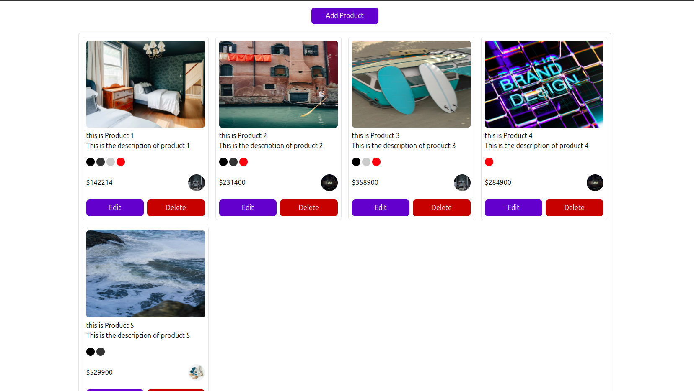
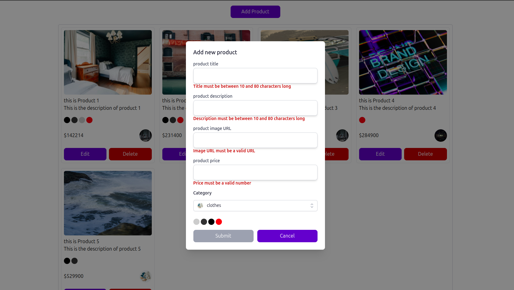
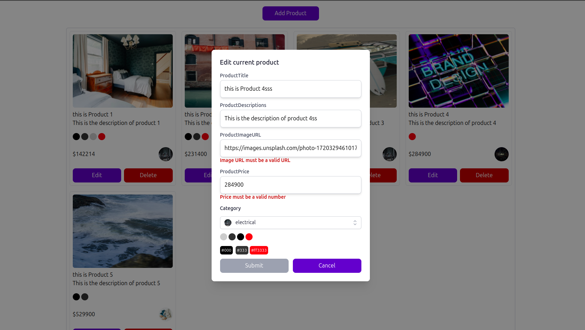

# Product Builder

This is a React/TS-based application for products builder . The application offers various functionalities to create, edit, delete the products, live here
[product builder](https://react-product-builder.netlify.app/)

## Table of Contents

- [Dependencies](#dependencies)
- [Installation](#installation)
- [Screenshots](#screenshots)
- [Contributing](#contributing)

## Dependencies

- **tailwindcss**
- **vite**
- **typescript**

## Installation

To get started with the project , follow these steps:

1. Clone the repository:

   ```sh
   git clone https://github.com/mohamedsaeed22/product-builder.git
   cd product-builder
   ```

2. Install the dependencies:

   ```sh
   npm install
   ```

3. Start the development server:

   ```sh
   npm run dev
   ```

The application will be available at `http://localhost:5173`.

## Screenshots

Here are some screenshots of the project:





## Contributing

Contributions are welcome! Please fork the repository and create a pull request with your changes. Ensure that your code adheres to the project's coding standards and includes appropriate tests.

1. Fork the repository
2. Create a new branch (`git checkout -b feature-branch`)
3. Commit your changes (`git commit -am 'Add new feature'`)
4. Push to the branch (`git push origin feature-branch`)
5. Create a new pull request
